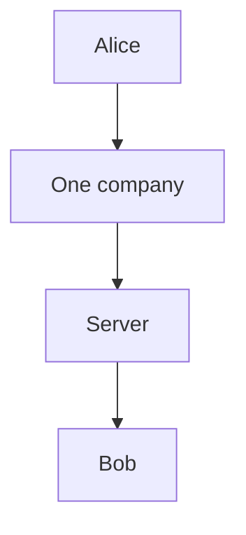
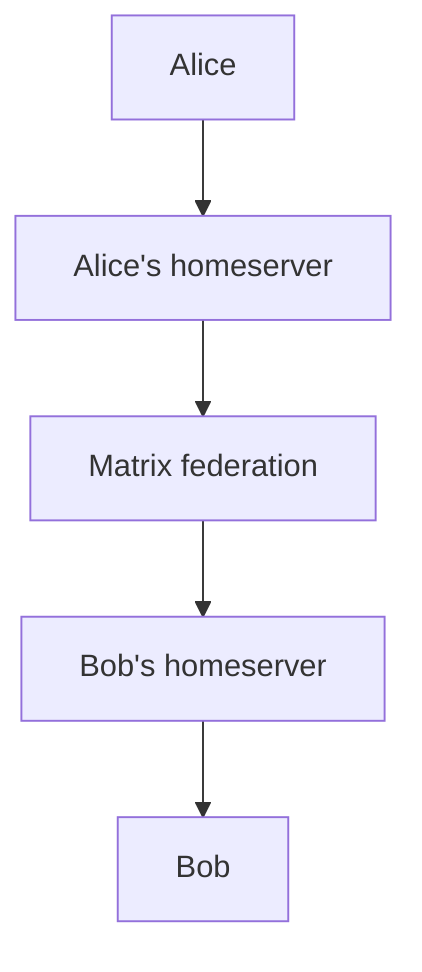
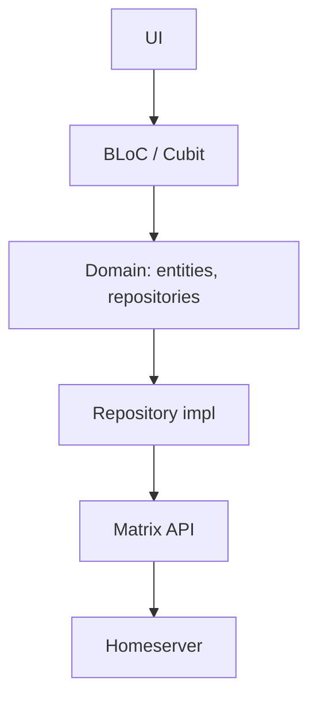

<div align="center">

# ConvetChat

**A modern Matrix client focused on simplicity, privacy and freedom.**

*Simple. Private. Decentralized.*

[](https://flutter.dev)
[](https://dart.dev)
[](https://matrix.org)
[](LICENSE)

</div>

## 💬 About

ConvetChat is an open-source Matrix client built with Flutter.

The goal of the project is to make Matrix feel simple and familiar while
preserving the freedom and decentralization of the Matrix protocol.

Instead of creating another closed messaging platform, ConvetChat is built
on top of Matrix — an open communication protocol that allows different
homeservers to communicate with each other.

A modern messenger experience on top of an open network.

## 🚧 Project Status

ConvetChat is currently under active development. The project is not
production-ready yet. Many features are still being developed, some parts of
the application may be incomplete, and bugs are expected. Things may change,
break, or be redesigned as development continues.

### Current availability

| Platform | Status |
| --- | --- |
| 🤖 Android | 🟢 Available as APK |
| 🍎 iOS | 🟡 In development / testing |
| 🪟 Windows | ⚪ Planned |
| 🐧 Linux | ⚪ Planned |
| 🍎 macOS | ⚪ Planned |
| 🌐 Web | ⚪ Planned |

At the moment, ConvetChat is distributed as an APK for Android. There are
currently no Google Play Store or Apple App Store releases. iOS development
and testing are ongoing.

## ✨ Features

ConvetChat already supports a growing set of Matrix functionality.

### 🔐 Your keys, your chat

- Full end-to-end encryption on the Rust [vodozemac](https://github.com/matrix-org/vodozemac)
  stack — the same crypto Element and friends use
- SAS device verification, so you know you are talking to the real person and
  not a hijacked session
- Encrypted key backup with your own passphrase and a recovery key you keep
- Credentials in the system keychain, never in plain text
- Sign in with an identity provider over SSO, without handing your password
  to a chat app

### 📎 Media that behaves

- Photo and video albums with a caption attached to the first one
- Voice messages with a live waveform, lock-to-record and swipe-to-cancel
- Swipe to reply, long-press to select, multi-select to copy, forward or delete
- Fullscreen viewer, in-app video player, share and forward anything
- Sending feels instant: the bubble appears the moment you hit send, with the
  live upload state on it

### 🌍 One client, every homeserver

- Log in to any homeserver, or point the app at your own
- Direct chats and group chats, with rooms you can browse and join
- Forwarding between your own rooms without leaving the chat
- Push notifications through a Matrix-compatible gateway, so a self-hosted
  setup still gets them

### 🎨 Built for the device it runs on

- Material 3 Expressive on Android, native Cupertino on iOS and macOS — the
  same chat, drawn the way each platform expects
- Dark and light themes, dynamic color, large-text friendly layouts
- In-app log viewer, so when something breaks you can read why instead of
  guessing
- Opt-in crash and analytics reporting — off means off

> Some features are still being improved and may not work perfectly in every
> situation.

## 🌐 Why Matrix?

Traditional messengers usually rely on one centralized service:



Matrix works differently:



Different homeservers can communicate with each other through federation.
This means your Matrix account is not tied to a single centralized messaging
provider. ConvetChat is a client built to make this ecosystem easier to use.

Learn more about Matrix: <https://matrix.org/>

## 🛠️ Tech Stack

| Technology | Purpose |
| --- | --- |
| Flutter | Cross-platform UI |
| Dart | Application language |
| [Matrix](https://matrix.org) | Communication protocol |
| flutter_vodozemac | Matrix end-to-end encryption |
| flutter_bloc | State management |
| get_it | Dependency injection |
| go_router | Navigation |
| sqflite | Local storage (Matrix SDK event store) |
| flutter_secure_storage | Secure credential storage |
| firebase_messaging | Push notifications |
| flutter_local_notifications | Background notifications |
| firebase_analytics, firebase_crashlytics | Opt-in telemetry |
| talker_flutter | In-app logging |
| just_audio, video_player | Media playback |

## 🏗️ Architecture

ConvetChat follows a feature-oriented architecture with separation between
presentation, domain and data layers.

### Simplified application flow



### Project structure

```
lib/
├── app/          # bootstrap, router, theme, adaptive widgets
├── core/         # DI, logging, Matrix helpers, push, platform style
├── features/     # auth, chat, chats, encryption, home, settings, welcome
│                  #   └── data / domain / ui layers per feature
└── main.dart
```

## 📱 Getting the App

### Android

Currently, the Android version is available as an APK. There is no Google Play
release yet.

Download the latest APK from the project's GitHub Releases page:
<https://github.com/frevod/convetchat/releases>

Android may show a warning when installing an APK from outside Google Play. This
is expected for applications distributed directly as APK files.

### iOS

The iOS version is currently under development and testing. There is no App
Store release yet.

## 🚀 Building from Source

### Requirements

- Flutter SDK
- Dart SDK `^3.13.2`
- Android SDK for Android development
- Xcode + macOS for iOS development

Check your Flutter environment:

```bash
flutter doctor
```

### Clone

```bash
git clone https://github.com/frevod/convetchat.git
cd convetchat
```

### Install dependencies

```bash
flutter pub get
```

### Configure environment

Create your local environment file:

```bash
cp .env.example .env
```

Configure the required values (they enable the in-app Telegram feedback form).

> Never commit private credentials, tokens, signing keys or other secrets to Git.

### Run

```bash
flutter run
```

> Android builds require your own `android/app/google-services.json` (not
> committed). Debug builds use the application id `com.convet.convetchat.debug`,
> so it must contain a client entry for that package name too.

## 🧪 Development

Run static analysis:

```bash
flutter analyze
```

Run tests:

```bash
flutter test
```

Build Android APK:

```bash
flutter build apk
```

Build iOS:

```bash
flutter build ios
```

> iOS builds require macOS/Xcode or an appropriate CI/CD service.

## 🐛 Bugs & Feedback

Since ConvetChat is still under development, bugs are expected.

If you find something that doesn't work:

1. Check existing GitHub Issues.
2. Open a new issue if necessary.
3. Describe what happened.
4. Include steps to reproduce the problem.
5. Add screenshots or logs if useful.

> Please never post private information, access tokens, passwords, recovery keys
> or encryption keys in an issue.

## 🤝 Contributing

Contributions, ideas and bug reports are welcome.

If you'd like to contribute:

```bash
git clone https://github.com/frevod/convetchat.git
cd convetchat
flutter pub get
```

Then create a branch, make your changes and open a Pull Request.

## 📜 License

See [LICENSE](LICENSE) for the current license information.

## 🔗 Links

- GitHub: <https://github.com/frevod/convetchat>
- Releases: <https://github.com/frevod/convetchat/releases>
- Matrix: <https://matrix.org/>

---

<div align="center">

**Built with Flutter. Powered by Matrix. Still under construction.**

⭐ If you like the project, consider giving it a star.

</div>
